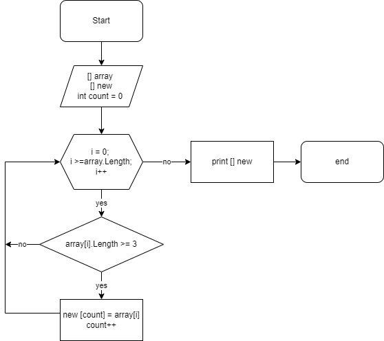

Итоговая задача: Написать программу, которая из имеющегося массива из строк формирует массив из строк, длина которых меньше либо равна 3 символа. Первоначальный массив можно ввести с клавиатуры либо задать на старте выполнения алгоритма.  При решении не рекомендуется пользоваться коллекциями, лучше обойтись исключительно массивами. 
Блок-схема решения задачи: 